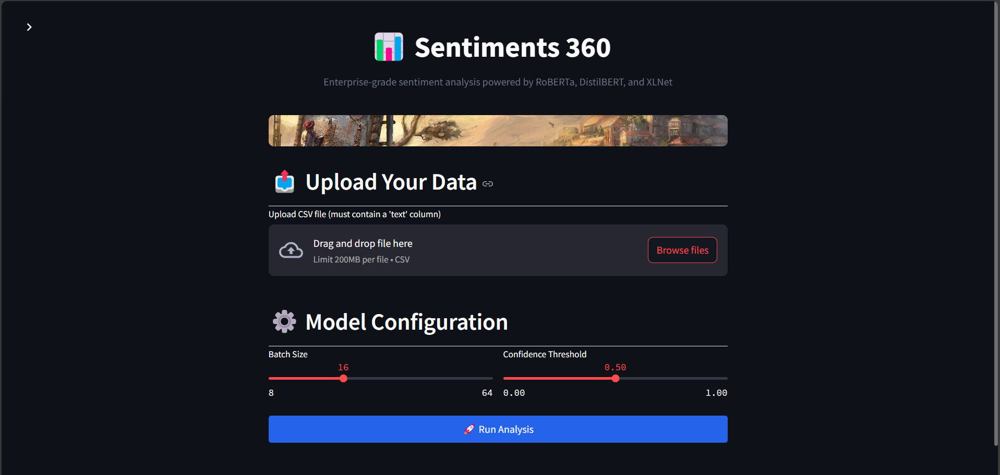
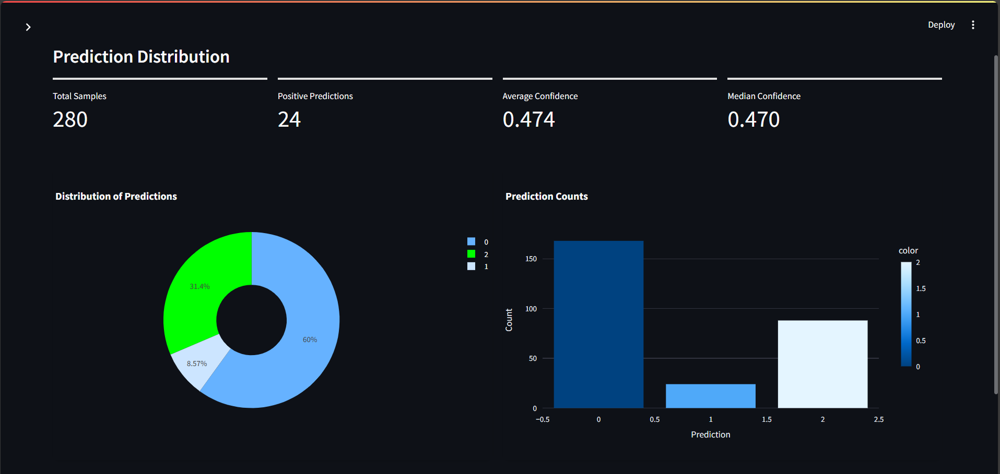
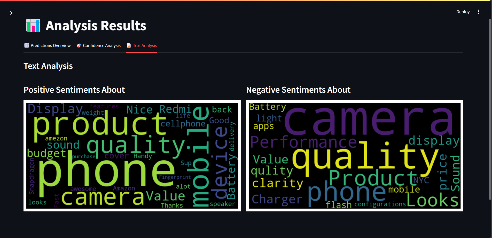
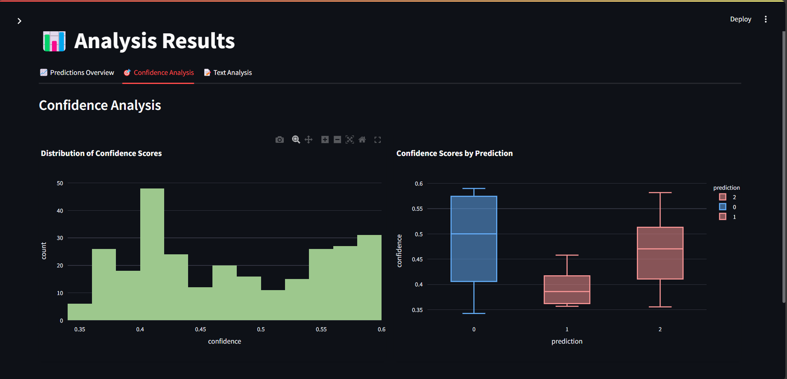

# RoBerta and DistillBert Based Advanced Abstract Based Sentiment Analysis App

## Overview
An advanced sentiment analysis system trained on Flipkart product reviews, combining the power of RoBERTa and DistilBERT models in an ensemble approach. The system not only classifies sentiment but also extracts key aspects from negative reviews for better insights.

## Application Screenshots


*Main application dashboard showing sentiment distribution*


*Detailed analysis results with sentiment breakdown*


*Extracts the context of the reviews*


*gives confidence of the model*

## Features
- **Ensemble Model Architecture**
    - Fine-tuned RoBERTa
    - Fine-tuned DistilBERT
    - Enhanced accuracy through model combination

- **Sentiment Analysis Capabilities**
    - Positive/Negative classification
    - Confidence scores
    - Abstract extraction from negative reviews

- **Review Analysis Features**
    - Aspect-based sentiment extraction
    - Key pain points identification
    - Review summarization

## Usage
```python
# Import required libraries
from transformers import pipeline, AutoTokenizer, AutoModelForSequenceClassification
from sentiment_analyzer import FlipkartAnalyzer

# Load models from Hugging Face Hub
roberta_model = AutoModelForSequenceClassification.from_pretrained("ayusrjn/RoBerta-finetuned-flipkar-review")
roberta_tokenizer = AutoTokenizer.from_pretrained("roberta-base")

distilbert_model = AutoModelForSequenceClassification.from_pretrained("ayusrjn/distillBert-finetuned-on-flipkart-reviews")
distilbert_tokenizer = AutoTokenizer.from_pretrained("distilbert-base-uncased")

```

# Change the model path in the application 
  pages/1_Results.py
  ```python
  // line 66 to 71
  results_df = predict_from_csv(
                csv_path=temp_csv_path,
                text_column='Comments',
                roberta_path=roberta_model,
                distil_path=distilbert,
                num_labels=3)
 ```
# Change absa model path 
absa.py 
  ```python
  model = AbsaModel.from_pretrained(
    "models\setfit-absa-model-aspect",
    "models\setfit-absa-model-polarity"
)
# Download the model from Hugging Face "ayusrjn/setfit-absa/setfit-absa-model-aspect" and "ayusrjn/setfit-absa/setfit-absa-model-aspect"

 ```

## Example File
example.csv


## Installation
```bash
pip install -r requirements.txt
```

## Running
```bash
streamlit run app1.py
```


## License
MIT License

